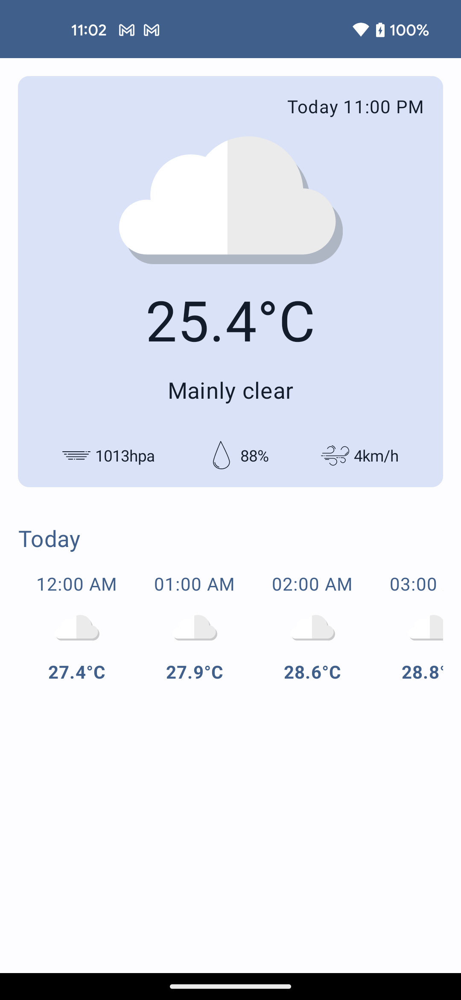
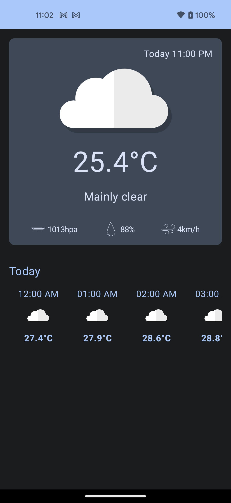

# Weather Application

This is a simple weather application that provides the current weather conditions of a location. The application uses the Open-Meteo API to fetch the weather data.

## Technologies Used
- Material 3
- Kotlin
- Compose
- Retrofit
- Hilt-dagger

## Usage
Allow location permission inorder to get the weather data

## Contributing
Contributions are welcome! Please feel free to submit a pull request or open an issue.

## License
This project is licensed under the MIT License - see the LICENSE file for details.

## Screenshot

  
   
  <em>Light mode</em>

  
   
  <em>Dark mode</em>

